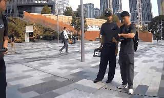

# B2 Robot Vision Models - Detection Pipeline


A ready-to-run inference toolkit for the team's YOLOX-nano ONNX detectors — bin
fullness, electrical cabinet state, and firehose cabinet state. Three ways to run
it: a command line script, a multi-model command line script, and a point-and-click
GUI. Works on images, folders of images, video files, and live cameras.

---

## Table of contents

1. [What this actually does](#1-what-this-actually-does)
2. [Files in this project](#2-files-in-this-project)
3. [The four models](#3-the-four-models)
4. [Moving it to another laptop](#4-moving-it-to-another-laptop)
5. [Setup](#5-setup)
6. [detect.py — one model at a time](#6-detectpy-one-model-at-a-time)
7. [detect_all.py — every model at once](#7-detect_allpy-every-model-at-once)
8. [detect_gui.py — point and click](#8-detect_guipy-point-and-click)
9. [The verdict system](#9-the-verdict-system)
10. [Output formats](#10-output-formats)
11. [Using it as a Python library](#11-using-it-as-a-python-library)
12. [The model architecture, in detail](#12-the-model-architecture-in-detail)
13. [Running this on the Unitree B2 robot](#13-running-this-on-the-unitree-b2-robot)
14. [Troubleshooting](#14-troubleshooting)
15. [Known gaps and TODO](#15-known-gaps-and-todo)
16. [Full source code](#16-full-source-code)

---

## 1. What this actually does

You give it a picture or a video. It tells you the state of what's in it.

```
   photo.jpg                              photo_pred.jpg
  +------------+                         +------------+
  |            |                         |  +------+  |
  |    [bin]   |  -->  detect.py  -->    |  |bin_  |  |
  |            |                         |  |full  |  |
  |            |                         |  |0.87  |  |
  +------------+                         +--+------+--+
```

For a video it goes one step further: instead of just boxing every frame, it
collapses all the frames into **one final answer** — "this clip shows a full bin,
81% confidence, seen in 21 of 78 frames" — so you don't have to eyeball the whole
clip yourself.

There are three models covering three different things the robot needs to check,
plus the original prototype:

| Model | Question it answers |
|---|---|
| `bin_fullness_nano_v3.onnx` | Is this bin empty or full? |
| `electrical_cabinet_nano_v2.onnx` | Is this electrical cabinet open or closed? |
| `firehose_cabinet_nano_v2.onnx` | Is this firehose cabinet open or closed? |
| `bin_fullness_nano.onnx` | Original prototype bin model (kept for reference) |

**What this project is:** the vision brain for all three checks — frame in, answer
out. **What this project is not:** it is not yet wired into the robot's camera feed
or control system. See [section 13](#13-running-this-on-the-unitree-b2-robot).

---

## 2. Files in this project

```
B2 POI/
├── detect.py           <- run ONE model against a source (CLI)
├── detect_all.py        <- run ALL models against a source at once (CLI)
├── detect_gui.py         <- point-and-click window version of detect.py
├── requirements.txt
├── README.md              <- this file
└── models/
    ├── bin_fullness_nano.onnx        <- original prototype  (960 KB + 3.4 MB .data)
    ├── bin_fullness_nano.onnx.data
    ├── bin_fullness_nano_v3.onnx     <- current bin model    (4.3 MB, self-contained)
    ├── electrical_cabinet_nano_v2.onnx <- cabinet model      (4.3 MB, self-contained)
    └── firehose_cabinet_nano_v2.onnx   <- firehose model     (4.3 MB, self-contained)
```

That's it — three scripts, one folder of models. `detect_all.py` and `detect_gui.py`
both import `detect.py` directly rather than duplicating its logic, so there is only
one copy of the actual detection code to keep correct.

### Files in this folder that are NOT part of the project

`Gemini_Generated_Image_*.png`, `variations/`, `dataset/`, `runs/`, `__pycache__/`,
and any loose test images like `Bin_full.jpeg` — unrelated leftovers and test
output. Do not copy them when moving the project.

---

## 3. The four models

All four share the same architecture (YOLOX-nano, 416x416 input, 2 output classes)
and the same `detect.py` code runs any of them — only `--model` and `--classes`
change. See [section 12](#12-the-model-architecture-in-detail) for the shared
technical details.

### bin_fullness_nano_v3.onnx (current)

```bash
python detect.py --model models\bin_fullness_nano_v3.onnx --source photo.jpg
```
Default classes: `bin_empty,bin_full`. Self-contained, single file.

### bin_fullness_nano.onnx (original prototype)

```bash
python detect.py --model models\bin_fullness_nano.onnx --source photo.jpg
```
Same classes. **Needs `models\bin_fullness_nano.onnx.data` alongside it** — see the
warning in [section 4](#4-moving-it-to-another-laptop). Kept for comparison against v3;
v3 is the one to use day to day.

### electrical_cabinet_nano_v2.onnx

```bash
python detect.py --model models\electrical_cabinet_nano_v2.onnx --classes "cab_closed,cab_open" --source photo.jpg
```

### firehose_cabinet_nano_v2.onnx

```bash
python detect.py --model models\firehose_cabinet_nano_v2.onnx --classes "hose_closed,hose_open" --source photo.jpg
```
This one has been the most reliable in testing so far — clean, unanimous verdicts
(e.g. 97% frame agreement, 81% confidence) on real robot camera footage.

### Checksums

```
MD5 (bin_fullness_nano.onnx)          = 4b8a85e896ac14ea643dc4fd0d20ac93
MD5 (bin_fullness_nano.onnx.data)     = 64491b38c98f58609a87bc0238f4f41c
MD5 (bin_fullness_nano_v3.onnx)       = 9e1c9d137271cbcc46d9151e0ff6635e
MD5 (electrical_cabinet_nano_v2.onnx) = 95e15cab26c8d7517e3d16bfb7caf999
MD5 (firehose_cabinet_nano_v2.onnx)   = 5f684fa7ee24255d3e9a1fd12786a511
```

Verify with:
```bash
md5sum models\*.onnx models\*.data
```

### Important: class names are NOT stored in any of these files

None of the four exports carry class-name metadata. Every `bin_empty`, `cab_open`,
`hose_closed`, and so on above is a **placeholder I chose**, not something read out
of the model. Confirm the true class order for each model against its training
config before trusting the labels. See the testing notes in
[section 15](#15-known-gaps-and-todo).

---

## 4. Moving it to another laptop

Copy the whole project folder, or just these:

```
detect.py
detect_all.py
detect_gui.py
requirements.txt
README.md
models\bin_fullness_nano_v3.onnx
models\electrical_cabinet_nano_v2.onnx
models\firehose_cabinet_nano_v2.onnx
models\bin_fullness_nano.onnx          (optional - the old prototype)
models\bin_fullness_nano.onnx.data     (required only if you keep the line above)
```

**The one file pair that must stay together:** `bin_fullness_nano.onnx` and
`bin_fullness_nano.onnx.data`. That model was exported with external weights — the
`.onnx` file is just a wiring diagram that points at the `.data` file by exact name.
Rename or separate them and it will refuse to load. The three newer models
(`_v3`, `electrical_cabinet`, `firehose_cabinet`) don't have this problem — each is
a single self-contained file.

Archive everything at once:
```bash
tar -czf b2_vision_pipeline.tar.gz detect.py detect_all.py detect_gui.py requirements.txt README.md models\
```

If any script file is lost, every one of them can be rebuilt verbatim from
[section 16](#16-full-source-code) of this file.

---

## 5. Setup

Requires **Python 3.9 or newer**. Verified on Python 3.14, Windows 11.

```bash
pip install -r requirements.txt
```

| Package | Why |
|---|---|
| `onnxruntime` | runs the models |
| `opencv-python` | reads/writes images and video, draws boxes |
| `numpy` | array maths for the decode step |
| `pillow` | image display inside the GUI (detect_gui.py only) |

Confirm the CLI works:
```bash
python detect.py --source 0 --show
```
If a camera window opens, you're set. Press `q` to close it.

### Optional: NVIDIA GPU
```bash
pip uninstall onnxruntime
pip install onnxruntime-gpu
```
then add `--gpu` to any `detect.py` command.

### Versions this was verified against
```
Python        3.14.6
onnxruntime   1.29.0
opencv-python 5.0.0
numpy         2.4.6
pillow        12.2.0
```

---

## 6. detect.py — one model at a time

The main command-line tool. Run any single model against any source.

### A single photo
```bash
python detect.py --model models\bin_fullness_nano_v3.onnx --source photo.jpg --out results\
```

### A whole folder of photos
```bash
python detect.py --model models\bin_fullness_nano_v3.onnx --source .\photos --out results\
```

### A video file
```bash
python detect.py --model models\firehose_cabinet_nano_v2.onnx --classes "hose_closed,hose_open" --source clip.mp4 --out results\annotated.mp4
```

### Live camera, with a preview window
```bash
python detect.py --source 0 --show
```
`0` is the default camera. Press `q` or `Esc` to quit.

### Save detections as data
```bash
python detect.py --source photo.jpg --json results\detections.json
```

### Speed up video processing
```bash
python detect.py --source clip.mp4 --out results\annotated.mp4 --stride 3
```
Runs the model on every 3rd frame, reusing boxes in between — roughly 3x faster.

### Require more agreement before trusting the verdict
```bash
python detect.py --source clip.mp4 --min-frames 10
```
The winning class must appear in at least this many frames, or the result comes
back `UNCERTAIN` instead of a confident-looking guess built on one fluke frame.
See [section 9](#9-the-verdict-system).

### All options

| Flag | Default | Meaning |
|---|---|---|
| `--source` | **required** | image file, folder, video file, or camera index (`0`) |
| `--model` | `models/bin_fullness_nano.onnx` | path to the `.onnx` file |
| `--out` | none | output folder (images) or `.mp4` path (video) |
| `--json` | none | write all detections + verdict to this JSON file |
| `--conf` | `0.35` | confidence threshold, 0.0-1.0 |
| `--iou` | `0.45` | overlap threshold for removing duplicate boxes |
| `--classes` | `bin_empty,bin_full` | class names, in class-id order |
| `--stride` | `1` | video only: run the model every Nth frame |
| `--min-frames` | `1` | video only: frames the winner must appear in to be trusted |
| `--show` | off | open a live preview window |
| `--gpu` | off | use NVIDIA CUDA if `onnxruntime-gpu` is installed |

**Tip:** point at any file with `--model` and pass the matching `--classes`, and the
same script runs any of the four models. Nothing else in the command changes.

---

## 7. detect_all.py — every model at once

Runs bin, cabinet, and firehose models **on the same frame in a single pass** — one
video decode instead of three. Useful when you want to see everything the robot's
whole vision stack would flag on one clip.

```bash
python detect_all.py --source clip.mp4 --out results\multi.mp4 --json results\multi.json
```

Each model gets its own colour (red = bin, blue = cabinet, green = firehose) and
its own independent verdict block:

```
========================================================
  BIN VERDICT:  BIN_EMPTY
  confidence 62%   seen in 64 of 233 frame(s)
========================================================
  CABINET VERDICT:  CAB_OPEN
  confidence 52%   seen in 45 of 233 frame(s)
========================================================
  FIREHOSE VERDICT:  HOSE_OPEN
  confidence 63%   seen in 75 of 233 frame(s)
========================================================
```

### Run only some models
```bash
python detect_all.py --models bin,firehose --source clip.mp4
```

### Options

Same as `detect.py` (`--conf`, `--iou`, `--stride`, `--min-frames`, `--show`,
`--json`, `--out`), plus:

| Flag | Default | Meaning |
|---|---|---|
| `--models-dir` | `models` | folder containing the `.onnx` files |
| `--models` | all three | comma-separated subset: `bin`, `cabinet`, `firehose` |

The model list (filename, class names, box colour) lives in `MODEL_REGISTRY` at
the top of `detect_all.py`. Adding a future 4th model is one line there.

---

## 8. detect_gui.py — point and click

A window version of `detect.py` for anyone who doesn't want to use a terminal at
all. Same detection logic underneath — it imports `BinFullnessDetector` and
`build_verdict` from `detect.py` directly, so results are identical to the CLI.

```bash
python detect_gui.py
```

### How to use it

1. **Model** — click **Browse...** and pick a `.onnx` file from `models\`.
   Picking a recognised model (bin/cabinet/firehose) auto-fills the class names.
2. **Classes** — auto-filled, editable if you want to test the swapped order.
3. **Source** — click **Image...** or **Video...**.
4. Adjust **Confidence** / **IoU** sliders, and for video, **Stride** / **Min
   frames**, if you want non-default values.
5. Click **Run Detection**.

Detection runs on a background thread, so the window stays responsive — for
video you'll see the preview update live every few frames.

### What you see

- **Preview** (left): the annotated frame — the single frame for an image, the
  last frame for a video.
- **Verdict** (top right): the same final answer `detect.py` would print —
  `BIN_FULL`, confidence, vote breakdown.
- **Log** (bottom right): progress messages as it runs.

### Saving results

Three buttons at the bottom:

| Button | What it saves |
|---|---|
| **Save Test Run...** | Everything at once, into one timestamped folder: the annotated frame (`annotated.jpg`), the full detections (`detections.json`), and a plain-text report (`report.txt`) recording the model, classes, source, thresholds, and verdict. Use this to archive a test so it can be compared against later ones. |
| **Save Annotated Output...** | Just the annotated frame, as a `.jpg` you choose the name for. |
| **Save Detections as JSON...** | Just the verdict + detections, as a `.json` you choose the name for. |

Example `report.txt` from **Save Test Run**:
```
BIN FULLNESS DETECTOR - TEST RUN REPORT
============================================
Run at      : 2026-08-21 17:27:53
Model       : models/firehose_cabinet_nano_v2.onnx
Classes     : hose_closed, hose_open
Source      : C:\...\raw_test_bag_...front_image_raw.mp4
Confidence threshold : 0.35
IoU threshold        : 0.45
Video stride         : 2
Min frames required  : 1

VERDICT
--------------------------------------------
HOSE_CLOSED
Confidence: 80%
Seen in 16 of 73 frame(s)
```

---

## 9. The verdict system

Every frame in a video "votes" with its single highest-confidence detection. Votes
are weighted by confidence, so a handful of strong frames outrank a longer run of
weak, marginal ones. The class with the highest `frames x average_confidence`
score wins.

```
  FINAL VERDICT:  BIN_EMPTY
  confidence 70%   seen in 21 of 78 frame(s)
  ----------------------------------------
  vote breakdown:
    bin_empty       20 frame(s)   95%  avg 0.70  best 0.84
    bin_full         1 frame(s)    5%  avg 0.46  best 0.46
```

This is the single most useful thing to read when judging whether a result is
real: **a sustained lock across many consecutive frames with rising confidence is
a real object.** A one-off detection at low confidence, especially competing
against a much stronger opposite class, is noise. Compare the two example clips
tested during development — a genuine bin gave 20/21 frames agreeing at up to 84%
confidence as the robot approached it; a scene with no bin at all gave scattered,
inconsistent single-frame hits with no pattern.

### `--min-frames`

Guards against one fluke frame deciding the verdict:

```bash
python detect.py --source clip.mp4 --min-frames 10
```

If the winning class doesn't reach that many frames, the verdict comes back
`UNCERTAIN` with the best guess shown, rather than a confident-looking answer
that isn't backed by enough evidence. This is the setting to raise for anything
feeding an automated decision (e.g. the robot flagging a bin), and the setting to
leave at `1` for casual browsing of a clip.

### For images and folders

A single image only has one frame, so its "verdict" is just its strongest
detection. Running on a folder prints a per-image verdict plus a tally at the end
(`bin_full: 3 images, nothing found: 5 images`, etc.) — useful for a quick
before/after read across a batch of test photos.

---

## 10. Output formats

### Annotated images and video

A copy of the input with a coloured box around each detection, labelled with class
name and confidence (e.g. `bin_full 0.87`). Images save as
`<name>_pred.<ext>`. `detect_all.py` labels each box with its model name too
(e.g. `bin: bin_empty 0.70`) so overlapping detections from different models stay
distinguishable.

### JSON (detect.py)

```json
{
  "verdict": {
    "verdict": "bin_full",
    "confidence": 0.81,
    "frames_analysed": 78,
    "frames_with_detection": 21,
    "per_class": {
      "bin_full": {"frames": 20, "best": 0.84, "avg_conf": 0.7}
    }
  },
  "frames": [
    {"frame": 6, "detections": [
      {"class_id": 1, "label": "bin_full", "confidence": 0.75,
       "box": [241.7, 345.7, 350.6, 436.1]}
    ]}
  ]
}
```

- `box` is `[x1, y1, x2, y2]` in **pixels of the original image**, not the
  resized 416x416 one — the letterbox padding and scale are already undone.
- For a single image, the top level is a list of `{source, verdict, detections}`
  instead of `{verdict, frames}`.

### JSON (detect_all.py)

Same shape, but `verdicts` and each frame's `models` key are dictionaries keyed
by model name (`bin`, `cabinet`, `firehose`).

---

## 11. Using it as a Python library

The entry point for a future robot integration:

```python
import cv2
from detect import BinFullnessDetector, build_verdict

# Load once, at startup - this takes a moment.
det = BinFullnessDetector(
    "models/bin_fullness_nano_v3.onnx",
    class_names=("bin_empty", "bin_full"),
    conf_thres=0.4,
)

# Then call it on as many frames as you like - this is the fast part.
frame = cv2.imread("photo.jpg")
detections = det(frame)
for d in detections:
    print(d["label"], d["confidence"], d["box"])

# Optionally collapse several frames (e.g. a rolling buffer) into one verdict
summary = build_verdict([detections], min_frames=1)
print(summary["verdict"], summary["confidence"])

annotated = det.draw(frame, detections)
cv2.imwrite("out.jpg", annotated)
```

`frame` must be a standard OpenCV BGR image (numpy array, `height x width x 3`).
Any size — resizing is handled internally. **Create `BinFullnessDetector` once and
reuse it** — rebuilding it on every frame would be enormously slower.

---

## 12. The model architecture, in detail

All four `.onnx` files share this shape. Facts below were read off the graph and
confirmed by test-running each model, not assumed.

| Property | Value |
|---|---|
| Architecture | YOLOX-nano (`YOLOPAFPN` neck + `CSPDarknet` backbone) |
| Exported from | PyTorch 2.13.0 + CUDA 13.0 |
| ONNX opset | 18 |
| Input tensor | `images`, float32, `[1, 3, 416, 416]` |
| Input layout | NCHW, **BGR**, **raw 0-255 pixel values** |
| Output tensor | `output`, float32, `[1, 3549, 7]` |
| Anchor count | 3549 = 52^2 + 26^2 + 13^2, strides 8 / 16 / 32 |
| Output columns | `[raw_x, raw_y, raw_w, raw_h, objectness, class0, class1]` |
| Classes | 2 (differ by model) |

### Two export quirks that will silently ruin results if anyone rewrites this

Both are already handled inside `detect.py`'s `preprocess` / `postprocess`. Any
future edit to those methods must preserve them.

**1. No normalisation.** These models consume raw pixel values — no `/255`, no
mean/std subtraction. Adding a `/255` doesn't error, it just quietly wrecks
accuracy.

**2. The head is not decoded.** `objectness`/class scores are already sigmoided.
Box coordinates are raw and need the grid decode:
```
x, y  =  (raw_xy + grid_cell_position) * stride
w, h  =  exp(raw_wh) * stride
```
Skip this and every box collapses near the top-left corner.

### Class names are guesses, not metadata

None of the four `.onnx` files carry class-name metadata. Every default in this
project (`bin_empty,bin_full`, `cab_closed,cab_open`, `hose_closed,hose_open`) is
a placeholder chosen to be plausible, not something read from the file. Confirm
against each model's training config, or verify empirically on footage with a
known ground truth, and correct with `--classes` if wrong.

---

## 13. Running this on the Unitree B2 robot

### Status: not integrated yet

This toolkit reads from a file, folder, or plain camera index and writes to a
file or window. It does not talk to the B2's own camera driver, control system,
or messaging layer. Below is the chain of what integration would involve.

```
  [1] Camera on the B2
        captures a live frame
              |
              v
  [2] Companion computer bolted to the robot
        (typically a Jetson Orin or similar)
              |
              v
  [3] THIS CODE  <-- what you have
        BinFullnessDetector(frame) -> [{label, confidence, box}]
        build_verdict(...) -> a decision over a rolling window of frames
              |
              v
  [4] Somewhere useful
        publish to the robot's message bus, log to a dashboard,
        trigger a robot behaviour ("stop and flag this bin")
```

You have step 3. Steps 1, 2, and 4 depend on the team's B2 software stack (ROS
version, camera topic, onboard compute, and what a detection should trigger),
which is outside what I have visibility into.

### What integration requires

**Getting frames in.** Replace file/webcam reading with the robot's camera feed —
for ROS, subscribe to the camera topic and convert the image message to an OpenCV
BGR array (typically via `cv_bridge`), then call `det(frame)` as in
[section 11](#11-using-it-as-a-python-library).

**Getting results out.** A product decision, not a code one: what should happen
when a detection is confirmed? Publish a message, log a position, trigger a stop?

**Temporal decisions on the robot.** `build_verdict` currently expects a full list
of frames after the fact. For a live robot you'd want a rolling window instead —
feed it the last N frames' detections continuously and re-evaluate the verdict
each time, rather than waiting for a clip to end. The function already supports
this; it just needs to be called on a sliding buffer instead of a full list.

**Hardware sizing.** The `nano` variant is the smallest YOLOX size, chosen for
exactly this kind of embedded use. Measured at roughly 20-35 FPS on a laptop CPU
per model (see [section 15](#15-known-gaps-and-todo) for exact numbers per clip) — should
run comfortably on Jetson-class hardware, more so with GPU acceleration.

**Practicalities to expect on real deployment:** camera lens distortion and
mounting angle will differ from the training data, so re-check accuracy on real
robot footage (some of that testing has already started — see
[section 15](#15-known-gaps-and-todo)). Lighting outdoors vs. indoors matters. And
`--min-frames` (or the rolling-window equivalent) should be tuned so a single
noisy frame can't trigger a false alarm.

---

## 14. Troubleshooting

**`Model not found: models/...`**
Wrong working folder, or the model wasn't copied. `cd` into the project folder
first — every relative path in these commands is resolved from there.

**PowerShell says `can't open file '...\detect.py'`**
Same cause as above. Run `cd "C:\Users\ivanh\OneDrive\Desktop\B2 POI"` before any
command. Your prompt should read `PS C:\Users\ivanh\OneDrive\Desktop\B2 POI>`.

**An error about external data while loading `bin_fullness_nano.onnx`**
That's the one model with a separate `.data` file. It must be named exactly
`bin_fullness_nano.onnx.data` and sit in the same folder. Use `bin_fullness_nano_v3.onnx`
instead if you don't need the original prototype specifically — it's self-contained.

**`ModuleNotFoundError: No module named 'cv2'` (or `onnxruntime`, `numpy`, `PIL`)**
Run `pip install -r requirements.txt`.

**It finds nothing at all**
Lower the threshold: `--conf 0.1`. If it still finds nothing, the scene may
genuinely contain none of what the model looks for.

**It boxes random objects**
Raise the threshold: `--conf 0.5`. This is expected on footage outside the
model's training domain — see the false-positive examples in
[section 15](#15-known-gaps-and-todo).

**The labels look swapped**
Pass the reversed order, e.g. `--classes "bin_full,bin_empty"`. See
[section 12](#12-the-model-architecture-in-detail).

**A filename with spaces or `%` breaks the command**
Always quote the path: `--source "C:\Users\...\firehose % electrical9.mp4"`.
Dragging the file from Explorer into the terminal pastes it correctly quoted.

**Video processing is slow**
Use `--stride 3` or higher. Install `onnxruntime-gpu` and add `--gpu` on an
NVIDIA machine.

**Boxes appear bunched in a corner, all wrong**
The grid decode was broken by an edit. See the second export quirk in
[section 12](#12-the-model-architecture-in-detail).

**The GUI's preview image doesn't show**
`pillow` isn't installed: `pip install pillow`.

---

## 15. Known gaps and TODO

- **Class names are still unverified for all four models.** This is the single
  most important open item. Testing so far:
  - `bin_fullness_nano_v3.onnx`: two images clearly filenamed/described as
    "full bins" with visible rubbish were both classified `bin_empty` at
    91-92% confidence. Either the class order is inverted for this model, or it
    is currently wrong on full bins — unresolved.
  - `firehose_cabinet_nano_v2.onnx` has been the most consistent: multiple robot
    camera clips gave clean, high-agreement verdicts (e.g. 97% frame agreement at
    81% confidence on a clip described as closed). This model's class order looks
    more likely to be correct, but has not been independently confirmed against a
    training config.
  - `electrical_cabinet_nano_v2.onnx` has had limited real-domain testing so far.
- **Accuracy is otherwise unmeasured on in-domain data.** Pipeline mechanics
  (decode, box placement, scale) have been confirmed correct — boxes land in the
  right place at the right size. Whether each model's *predictions* are accurate
  needs a proper labelled test set, which does not exist yet for this project.
- **Out-of-domain false positives are expected and were observed.** On unrelated
  scenes (temple/lobby photos with no bin, cabinet, or hose), all three current
  models produced confident-looking but wrong detections — e.g. a person in an
  armchair boxed as `bin_full` at 63%, and the B2 robot's own leg boxed as
  `cab_open` at 61%. This is expected model behaviour on inputs outside training
  domain, not evidence the models are broken — but it means high confidence alone
  is not sufficient signal; use the verdict's frame-agreement pattern (see
  [section 9](#9-the-verdict-system)) to distinguish a real detection from noise.
- **No robot integration.** See [section 13](#13-running-this-on-the-unitree-b2-robot).
- **`build_verdict` is currently batch-only.** It expects the full list of a
  clip's frame detections at once. A live robot would want a rolling-window
  variant — straightforward to add, not yet built.
- **`--stride` reuses stale boxes** between inferred frames, so drawn boxes lag
  slightly behind fast motion when stride > 1.
- **Very small/tightly-cropped images don't work.** A 76x195px crop of a single
  bin opening produced no usable detection (7% confidence at best) — the models
  expect a whole object with context, not an extreme close-up, and heavy upscaling
  to 416x416 degrades tiny inputs badly.

---

## 16. Full source code

### requirements.txt

```
numpy>=1.24
opencv-python>=4.8
onnxruntime>=1.17
pillow>=10.0
# For NVIDIA GPU, swap the onnxruntime line above for:
# onnxruntime-gpu>=1.17
```

### detect.py

```python
"""
Bin-fullness detection pipeline (YOLOX-nano ONNX).

Runs on images, folders of images, video files, or a live camera.

    python detect.py --source photo.jpg
    python detect.py --source ./photos --out runs/
    python detect.py --source clip.mp4 --out runs/annotated.mp4
    python detect.py --source 0 --show
"""

from __future__ import annotations

import argparse
import json
import sys
import time
from pathlib import Path

import cv2
import numpy as np
import onnxruntime as ort

# The exported head emits raw offsets for xywh; obj/cls are already sigmoided.
STRIDES = (8, 16, 32)
IMAGE_EXTS = {".jpg", ".jpeg", ".png", ".bmp", ".webp", ".tif", ".tiff"}
VIDEO_EXTS = {".mp4", ".mov", ".avi", ".mkv", ".m4v", ".webm", ".mpg", ".mpeg"}
DEFAULT_CLASSES = ("bin_empty", "bin_full")


class BinFullnessDetector:
    def __init__(
        self,
        model_path,
        class_names=DEFAULT_CLASSES,
        conf_thres=0.35,
        iou_thres=0.45,
        providers=None,
    ):
        self.conf_thres = conf_thres
        self.iou_thres = iou_thres

        opts = ort.SessionOptions()
        opts.graph_optimization_level = ort.GraphOptimizationLevel.ORT_ENABLE_ALL
        self.session = ort.InferenceSession(
            str(model_path),
            sess_options=opts,
            providers=providers or ["CPUExecutionProvider"],
        )

        inp = self.session.get_inputs()[0]
        self.input_name = inp.name
        shape = [d if isinstance(d, int) else 416 for d in inp.shape]
        self.in_h, self.in_w = shape[2], shape[3]

        n_out = self.session.get_outputs()[0].shape[-1]
        n_cls = n_out - 5 if isinstance(n_out, int) else len(class_names)
        if len(class_names) != n_cls:
            class_names = tuple("class_%d" % i for i in range(n_cls))
        self.class_names = class_names

        self._grids, self._strides = self._build_grids()
        self._colors = self._build_colors(len(class_names))

    # ---------- graph plumbing ----------

    def _build_grids(self):
        """Anchor centres and their strides, ordered to match the concatenated head."""
        grids, strides = [], []
        for stride in STRIDES:
            hsize, wsize = self.in_h // stride, self.in_w // stride
            yv, xv = np.meshgrid(np.arange(hsize), np.arange(wsize), indexing="ij")
            grids.append(np.stack((xv, yv), 2).reshape(-1, 2))
            strides.append(np.full((hsize * wsize, 1), stride))
        return (
            np.concatenate(grids, 0).astype(np.float32),
            np.concatenate(strides, 0).astype(np.float32),
        )

    @staticmethod
    def _build_colors(n):
        hsv = np.array([[[int(180 * i / max(n, 1)), 220, 255]] for i in range(n)], np.uint8)
        bgr = cv2.cvtColor(hsv, cv2.COLOR_HSV2BGR).reshape(-1, 3)
        return [tuple(int(c) for c in row) for row in bgr]

    # ---------- pre / post ----------

    def preprocess(self, frame):
        """Letterbox onto a 114-grey canvas, keeping aspect ratio.

        No /255 scaling and no mean/std - YOLOX consumes raw BGR pixel values.
        """
        h, w = frame.shape[:2]
        r = min(self.in_h / h, self.in_w / w)
        nh, nw = int(round(h * r)), int(round(w * r))
        pad_y, pad_x = (self.in_h - nh) // 2, (self.in_w - nw) // 2

        canvas = np.full((self.in_h, self.in_w, 3), 114, np.uint8)
        interp = cv2.INTER_AREA if r < 1 else cv2.INTER_LINEAR
        canvas[pad_y:pad_y + nh, pad_x:pad_x + nw] = cv2.resize(frame, (nw, nh), interpolation=interp)

        blob = canvas.transpose(2, 0, 1)[None].astype(np.float32)  # NCHW, BGR
        return np.ascontiguousarray(blob), r, (pad_x, pad_y)

    def postprocess(self, raw, ratio, pad, shape):
        pred = raw[0]
        xy = (pred[:, :2] + self._grids) * self._strides
        wh = np.exp(pred[:, 2:4]) * self._strides
        scores = pred[:, 4:5] * pred[:, 5:]

        cls_ids = scores.argmax(1)
        confs = scores[np.arange(len(scores)), cls_ids]
        keep = confs > self.conf_thres
        if not keep.any():
            return []

        xy, wh, confs, cls_ids = xy[keep], wh[keep], confs[keep], cls_ids[keep]

        # centre-xywh -> corner-xyxy, undo the letterbox, clamp to the frame
        boxes = np.empty((len(xy), 4), np.float32)
        boxes[:, :2] = xy - wh / 2
        boxes[:, 2:] = xy + wh / 2
        boxes[:, [0, 2]] -= pad[0]
        boxes[:, [1, 3]] -= pad[1]
        boxes /= ratio

        h, w = shape
        boxes[:, [0, 2]] = boxes[:, [0, 2]].clip(0, w - 1)
        boxes[:, [1, 3]] = boxes[:, [1, 3]].clip(0, h - 1)

        dets = []
        for cid in np.unique(cls_ids):
            m = cls_ids == cid
            cb, cc = boxes[m], confs[m]
            xywh = np.stack([cb[:, 0], cb[:, 1], cb[:, 2] - cb[:, 0], cb[:, 3] - cb[:, 1]], 1)
            idx = cv2.dnn.NMSBoxes(
                xywh.tolist(), cc.astype(float).tolist(), self.conf_thres, self.iou_thres
            )
            for i in np.array(idx).reshape(-1):
                x1, y1, x2, y2 = cb[i]
                dets.append({
                    "class_id": int(cid),
                    "label": self.class_names[int(cid)],
                    "confidence": round(float(cc[i]), 4),
                    "box": [round(float(v), 1) for v in (x1, y1, x2, y2)],
                })
        dets.sort(key=lambda d: -d["confidence"])
        return dets

    def __call__(self, frame):
        blob, ratio, pad = self.preprocess(frame)
        raw = self.session.run(None, {self.input_name: blob})[0]
        return self.postprocess(raw, ratio, pad, frame.shape[:2])

    # ---------- drawing ----------

    def draw(self, frame, dets):
        out = frame.copy()
        thick = max(1, round(0.002 * max(out.shape[:2])))
        for d in dets:
            x1, y1, x2, y2 = (int(v) for v in d["box"])
            color = self._colors[d["class_id"]]
            cv2.rectangle(out, (x1, y1), (x2, y2), color, thick)

            text = "%s %.2f" % (d["label"], d["confidence"])
            (tw, th), _ = cv2.getTextSize(text, cv2.FONT_HERSHEY_SIMPLEX, 0.5, 1)
            ty = max(y1, th + 4)
            cv2.rectangle(out, (x1, ty - th - 4), (x1 + tw + 2, ty), color, -1)
            cv2.putText(out, text, (x1 + 1, ty - 3), cv2.FONT_HERSHEY_SIMPLEX,
                        0.5, (0, 0, 0), 1, cv2.LINE_AA)
        return out


# ---------- verdict ----------

def build_verdict(frame_dets, min_frames=1):
    """Collapse many per-frame detections into one final answer.

    Each frame votes with its single highest-confidence detection. Votes are
    weighted by confidence, so a handful of strong frames outrank a longer run of
    marginal ones. `min_frames` guards against one fluke frame deciding the call.
    """
    votes = {}
    frames_with = 0
    for dets in frame_dets:
        if not dets:
            continue
        frames_with += 1
        top = max(dets, key=lambda d: d["confidence"])
        v = votes.setdefault(top["label"], {"frames": 0, "_sum": 0.0, "best": 0.0})
        v["frames"] += 1
        v["_sum"] += top["confidence"]
        v["best"] = max(v["best"], top["confidence"])

    summary = {
        "verdict": "no_detection",
        "confidence": 0.0,
        "frames_analysed": len(frame_dets),
        "frames_with_detection": frames_with,
        "per_class": {},
    }
    if not votes:
        return summary

    for v in votes.values():
        v["avg_conf"] = round(v["_sum"] / v["frames"], 4)
        v["best"] = round(v["best"], 4)
        del v["_sum"]

    winner = max(votes, key=lambda k: votes[k]["frames"] * votes[k]["avg_conf"])
    summary["per_class"] = votes
    summary["confidence"] = votes[winner]["avg_conf"]
    summary["verdict"] = winner if votes[winner]["frames"] >= min_frames else "uncertain"
    if summary["verdict"] == "uncertain":
        summary["best_guess"] = winner
        summary["min_frames_required"] = min_frames
    return summary


def print_verdict(summary, title="FINAL VERDICT"):
    bar = "=" * 56
    print("\n" + bar)
    v = summary["verdict"]

    if v == "no_detection":
        print("  %s: NOTHING FOUND" % title)
        print("  %d frame(s) analysed, nothing above the confidence threshold."
              % summary["frames_analysed"])
        print("  Try lowering --conf (e.g. --conf 0.2).")
        print(bar)
        return

    if v == "uncertain":
        print("  %s: UNCERTAIN" % title)
        print("  Best guess '%s', but seen in only %d frame(s) - fewer than the %d required."
              % (summary["best_guess"],
                 summary["per_class"][summary["best_guess"]]["frames"],
                 summary["min_frames_required"]))
    else:
        print("  %s:  %s" % (title, v.upper()))
        print("  confidence %.0f%%   seen in %d of %d frame(s)"
              % (summary["confidence"] * 100,
                 summary["frames_with_detection"], summary["frames_analysed"]))

    if len(summary["per_class"]) > 1:
        print("  " + "-" * 40)
        print("  vote breakdown:")
        for label, c in sorted(summary["per_class"].items(), key=lambda kv: -kv[1]["frames"]):
            share = 100.0 * c["frames"] / max(summary["frames_with_detection"], 1)
            print("    %-14s %3d frame(s)  %3.0f%%  avg %.2f  best %.2f"
                  % (label, c["frames"], share, c["avg_conf"], c["best"]))
    print(bar)


# ---------- sources ----------

def resolve_source(source):
    if source.isdigit():
        return "camera", int(source)
    p = Path(source)
    if p.is_dir():
        files = sorted(f for f in p.rglob("*") if f.suffix.lower() in IMAGE_EXTS)
        if not files:
            sys.exit("No images found under %s" % p)
        return "images", files
    if not p.exists():
        sys.exit("Source not found: %s" % p)
    if p.suffix.lower() in VIDEO_EXTS:
        return "video", str(p)
    if p.suffix.lower() in IMAGE_EXTS:
        return "images", [p]
    sys.exit("Unsupported file type: %s" % p.suffix)


def run_images(det, files, out_dir, show):
    results = []
    tally = {}
    for f in files:
        frame = cv2.imread(str(f))
        if frame is None:
            print("  skip (unreadable): %s" % f)
            continue
        t0 = time.perf_counter()
        dets = det(frame)
        ms = (time.perf_counter() - t0) * 1000
        print("%s: %d detection(s) in %.0f ms" % (f.name, len(dets), ms))
        for d in dets:
            print("    %-12s %.2f  %s" % (d["label"], d["confidence"], d["box"]))

        # One image is one "frame", so its verdict is just its strongest detection.
        summary = build_verdict([dets])
        label = summary["verdict"]
        if label == "no_detection":
            print("    -> VERDICT: nothing found")
        else:
            print("    -> VERDICT: %s (%.0f%% confidence)" % (label.upper(), summary["confidence"] * 100))
        tally[label] = tally.get(label, 0) + 1
        results.append({"source": str(f), "verdict": summary, "detections": dets})

        if out_dir or show:
            vis = det.draw(frame, dets)
            if out_dir:
                cv2.imwrite(str(out_dir / ("%s_pred%s" % (f.stem, f.suffix))), vis)
            if show:
                cv2.imshow("bin fullness", vis)
                if cv2.waitKey(0) & 0xFF in (27, ord("q")):
                    break

    # A folder holds unrelated scenes, so tally them rather than voting on one answer.
    if len(tally) and sum(tally.values()) > 1:
        bar = "=" * 56
        print("\n" + bar)
        print("  SUMMARY over %d image(s)" % sum(tally.values()))
        for label, n in sorted(tally.items(), key=lambda kv: -kv[1]):
            name = "nothing found" if label == "no_detection" else label
            print("    %-16s %3d image(s)" % (name, n))
        print(bar)
    return results


def run_video(det, src, out_path, show, stride, min_frames=1):
    cap = cv2.VideoCapture(src)
    if not cap.isOpened():
        sys.exit("Could not open video source: %s" % src)

    fps = cap.get(cv2.CAP_PROP_FPS) or 30.0
    w = int(cap.get(cv2.CAP_PROP_FRAME_WIDTH))
    h = int(cap.get(cv2.CAP_PROP_FRAME_HEIGHT))
    writer = None
    if out_path:
        out_path.parent.mkdir(parents=True, exist_ok=True)
        writer = cv2.VideoWriter(str(out_path), cv2.VideoWriter_fourcc(*"mp4v"), fps, (w, h))

    frames, dets, results, t0 = 0, [], [], time.perf_counter()
    inferred = []  # only the frames the model actually looked at, for the verdict
    try:
        while True:
            ok, frame = cap.read()
            if not ok:
                break
            # With --stride > 1 we infer on every Nth frame and reuse the last boxes in between.
            if frames % stride == 0:
                dets = det(frame)
                inferred.append(dets)
                results.append({"frame": frames, "detections": dets})
            vis = det.draw(frame, dets)
            frames += 1

            if writer:
                writer.write(vis)
            if show:
                cv2.imshow("bin fullness", vis)
                if cv2.waitKey(1) & 0xFF in (27, ord("q")):
                    break
            if frames % 50 == 0:
                elapsed = time.perf_counter() - t0
                print("  %d frames, %.1f FPS" % (frames, frames / max(elapsed, 1e-6)), end="\r")
    finally:
        cap.release()
        if writer:
            writer.release()

    elapsed = time.perf_counter() - t0
    print("\nProcessed %d frames in %.1fs (%.1f FPS)" % (frames, elapsed, frames / max(elapsed, 1e-6)))

    summary = build_verdict(inferred, min_frames)
    print_verdict(summary)
    return {"verdict": summary, "frames": results}


def main():
    ap = argparse.ArgumentParser(description="Bin-fullness detection (YOLOX-nano ONNX)")
    ap.add_argument("--source", required=True,
                    help="image, folder, video file, or camera index (e.g. 0)")
    ap.add_argument("--model", default="models/bin_fullness_nano.onnx")
    ap.add_argument("--out", help="output image folder or .mp4 path")
    ap.add_argument("--json", help="write detections to this JSON file")
    ap.add_argument("--conf", type=float, default=0.35)
    ap.add_argument("--iou", type=float, default=0.45)
    ap.add_argument("--classes", help="comma-separated class names, in class-id order")
    ap.add_argument("--stride", type=int, default=1, help="video: infer every Nth frame")
    ap.add_argument("--min-frames", type=int, default=1,
                    help="video: how many frames must agree before the verdict is trusted")
    ap.add_argument("--show", action="store_true", help="display a preview window")
    ap.add_argument("--gpu", action="store_true", help="try CUDA, fall back to CPU")
    args = ap.parse_args()

    if not Path(args.model).exists():
        sys.exit("Model not found: %s" % args.model)

    providers = ["CPUExecutionProvider"]
    if args.gpu:
        available = ort.get_available_providers()
        providers = [p for p in ("CUDAExecutionProvider", "CPUExecutionProvider") if p in available]

    names = tuple(c.strip() for c in args.classes.split(",")) if args.classes else DEFAULT_CLASSES
    det = BinFullnessDetector(args.model, names, args.conf, args.iou, providers)
    print("Model: %s  input %dx%d  classes %s" %
          (args.model, det.in_w, det.in_h, list(det.class_names)))
    print("Provider: %s" % det.session.get_providers()[0])

    kind, src = resolve_source(args.source)
    if kind == "images":
        out_dir = Path(args.out) if args.out else None
        if out_dir:
            out_dir.mkdir(parents=True, exist_ok=True)
        results = run_images(det, src, out_dir, args.show)
    else:
        out_path = Path(args.out) if args.out else None
        if out_path and out_path.suffix.lower() != ".mp4":
            out_path = out_path / "annotated.mp4"
        results = run_video(det, src, out_path, args.show, max(1, args.stride),
                            max(1, args.min_frames))

    if args.show:
        cv2.destroyAllWindows()
    if args.json:
        Path(args.json).parent.mkdir(parents=True, exist_ok=True)
        Path(args.json).write_text(json.dumps(results, indent=2))
        print("Wrote %s" % args.json)
    if args.out:
        print("Output: %s" % args.out)


if __name__ == "__main__":
    main()
```

### detect_all.py

```python
"""
Multi-model detection - run every configured model against the same source
in a single pass (one video decode, not four).

    python detect_all.py --source photo.jpg --out results/
    python detect_all.py --source clip.mp4 --out results/annotated.mp4
    python detect_all.py --source 0 --show

Each model gets its own verdict, its own colour, and its own row in the
combined summary. Detections from all models are drawn onto the same frame,
so you see everything the robot's whole vision stack would see at once.
"""

from __future__ import annotations

import argparse
import json
import sys
import time
from pathlib import Path

import cv2
import numpy as np

from detect import BinFullnessDetector, build_verdict, print_verdict, resolve_source, IMAGE_EXTS

# name -> (model file relative to --models-dir, class names, box colour BGR)
MODEL_REGISTRY = {
    "bin":       ("bin_fullness_nano_v3.onnx",      ("bin_empty", "bin_full"),       (0, 0, 255)),   # red
    "cabinet":   ("electrical_cabinet_nano_v2.onnx", ("cab_closed", "cab_open"),      (255, 0, 0)),   # blue
    "firehose":  ("firehose_cabinet_nano_v2.onnx",   ("hose_closed", "hose_open"),    (0, 255, 0)),   # green
}


def load_models(models_dir: Path, only: list[str] | None, conf: float, iou: float):
    names = only or list(MODEL_REGISTRY.keys())
    loaded = {}
    for name in names:
        if name not in MODEL_REGISTRY:
            sys.exit("Unknown model '%s'. Known: %s" % (name, list(MODEL_REGISTRY.keys())))
        fname, classes, color = MODEL_REGISTRY[name]
        path = models_dir / fname
        if not path.exists():
            sys.exit("Model file not found: %s" % path)
        det = BinFullnessDetector(str(path), classes, conf, iou)
        loaded[name] = {"detector": det, "color": color}
        print("Loaded %-10s -> %s  classes %s" % (name, fname, list(classes)))
    return loaded


def draw_multi(frame, results_by_model):
    """Draw every model's boxes on one frame, colour-coded, model name tag included."""
    out = frame.copy()
    thick = max(1, round(0.002 * max(out.shape[:2])))
    for name, (dets, color) in results_by_model.items():
        for d in dets:
            x1, y1, x2, y2 = (int(v) for v in d["box"])
            cv2.rectangle(out, (x1, y1), (x2, y2), color, thick)
            text = "%s: %s %.2f" % (name, d["label"], d["confidence"])
            (tw, th), _ = cv2.getTextSize(text, cv2.FONT_HERSHEY_SIMPLEX, 0.5, 1)
            ty = max(y1, th + 4)
            cv2.rectangle(out, (x1, ty - th - 4), (x1 + tw + 2, ty), color, -1)
            cv2.putText(out, text, (x1 + 1, ty - 3), cv2.FONT_HERSHEY_SIMPLEX,
                        0.5, (255, 255, 255), 1, cv2.LINE_AA)
    return out


def run_frame(frame, models):
    """Run every model on one frame. Returns {name: (dets, color)}."""
    out = {}
    for name, m in models.items():
        out[name] = (m["detector"](frame), m["color"])
    return out


def run_images(models, files, out_dir, show):
    all_results = []
    per_model_frames = {name: [] for name in models}

    for f in files:
        frame = cv2.imread(str(f))
        if frame is None:
            print("  skip (unreadable): %s" % f)
            continue
        t0 = time.perf_counter()
        by_model = run_frame(frame, models)
        ms = (time.perf_counter() - t0) * 1000

        print("%s  (%.0f ms)" % (f.name, ms))
        entry = {"source": str(f), "models": {}}
        for name, (dets, _) in by_model.items():
            per_model_frames[name].append(dets)
            top = max(dets, key=lambda d: d["confidence"]) if dets else None
            tag = "%s %.2f" % (top["label"], top["confidence"]) if top else "nothing found"
            print("    %-10s -> %s  (%d box(es))" % (name, tag, len(dets)))
            entry["models"][name] = dets
        all_results.append(entry)

        if out_dir or show:
            vis = draw_multi(frame, by_model)
            if out_dir:
                cv2.imwrite(str(out_dir / ("%s_pred%s" % (f.stem, f.suffix))), vis)
            if show:
                cv2.imshow("multi-model detect", vis)
                if cv2.waitKey(0) & 0xFF in (27, ord("q")):
                    break

    print("\n" + "=" * 56)
    print("  SUMMARY over %d image(s)" % len(all_results))
    for name in models:
        s = build_verdict(per_model_frames[name])
        v = s["verdict"]
        tag = "nothing found" if v == "no_detection" else "%s (%.0f%%)" % (v, s["confidence"] * 100)
        print("    %-10s overall: %s" % (name, tag))
    print("=" * 56)
    return all_results


def run_video(models, src, out_path, show, stride, min_frames):
    cap = cv2.VideoCapture(src)
    if not cap.isOpened():
        sys.exit("Could not open video source: %s" % src)

    fps = cap.get(cv2.CAP_PROP_FPS) or 30.0
    w = int(cap.get(cv2.CAP_PROP_FRAME_WIDTH))
    h = int(cap.get(cv2.CAP_PROP_FRAME_HEIGHT))
    writer = None
    if out_path:
        out_path.parent.mkdir(parents=True, exist_ok=True)
        writer = cv2.VideoWriter(str(out_path), cv2.VideoWriter_fourcc(*"mp4v"), fps, (w, h))

    frames = 0
    by_model = {name: ([], models[name]["color"]) for name in models}
    per_model_frames = {name: [] for name in models}
    results = []
    t0 = time.perf_counter()

    try:
        while True:
            ok, frame = cap.read()
            if not ok:
                break
            if frames % stride == 0:
                by_model = run_frame(frame, models)
                frame_entry = {"frame": frames, "models": {}}
                for name, (dets, _) in by_model.items():
                    per_model_frames[name].append(dets)
                    frame_entry["models"][name] = dets
                results.append(frame_entry)

            vis = draw_multi(frame, by_model)
            frames += 1
            if writer:
                writer.write(vis)
            if show:
                cv2.imshow("multi-model detect", vis)
                if cv2.waitKey(1) & 0xFF in (27, ord("q")):
                    break
            if frames % 50 == 0:
                elapsed = time.perf_counter() - t0
                print("  %d frames, %.1f FPS" % (frames, frames / max(elapsed, 1e-6)), end="\r")
    finally:
        cap.release()
        if writer:
            writer.release()

    elapsed = time.perf_counter() - t0
    print("\nProcessed %d frames in %.1fs (%.1f FPS, %d model(s) each frame)"
          % (frames, elapsed, frames / max(elapsed, 1e-6), len(models)))

    verdicts = {}
    for name in models:
        summary = build_verdict(per_model_frames[name], min_frames)
        verdicts[name] = summary
        print_verdict(summary, title="%s VERDICT" % name.upper())

    return {"verdicts": verdicts, "frames": results}


def main():
    ap = argparse.ArgumentParser(description="Run all configured models on one source at once")
    ap.add_argument("--source", required=True, help="image, folder, video file, or camera index")
    ap.add_argument("--models-dir", default="models", help="folder containing the .onnx files")
    ap.add_argument("--models", help="comma-separated subset of: %s (default: all)"
                    % ",".join(MODEL_REGISTRY.keys()))
    ap.add_argument("--out", help="output image folder or .mp4 path")
    ap.add_argument("--json", help="write all detections + verdicts to this JSON file")
    ap.add_argument("--conf", type=float, default=0.35)
    ap.add_argument("--iou", type=float, default=0.45)
    ap.add_argument("--stride", type=int, default=1, help="video: infer every Nth frame")
    ap.add_argument("--min-frames", type=int, default=1,
                    help="video: how many frames must agree before a verdict is trusted")
    ap.add_argument("--show", action="store_true")
    args = ap.parse_args()

    only = [m.strip() for m in args.models.split(",")] if args.models else None
    models = load_models(Path(args.models_dir), only, args.conf, args.iou)
    print()

    kind, src = resolve_source(args.source)
    if kind == "images":
        out_dir = Path(args.out) if args.out else None
        if out_dir:
            out_dir.mkdir(parents=True, exist_ok=True)
        results = run_images(models, src, out_dir, args.show)
    else:
        out_path = Path(args.out) if args.out else None
        if out_path and out_path.suffix.lower() != ".mp4":
            out_path = out_path / "annotated.mp4"
        results = run_video(models, src, out_path, args.show, max(1, args.stride),
                            max(1, args.min_frames))

    if args.show:
        cv2.destroyAllWindows()
    if args.json:
        Path(args.json).parent.mkdir(parents=True, exist_ok=True)
        Path(args.json).write_text(json.dumps(results, indent=2))
        print("Wrote %s" % args.json)
    if args.out:
        print("Output: %s" % args.out)


if __name__ == "__main__":
    main()
```

### detect_gui.py

```python
"""
GUI front end for detect.py - load a model, an image or video, and run.

    python detect_gui.py

No command line needed. Pick a model file, pick a source, click Run.
Reuses BinFullnessDetector and build_verdict from detect.py directly, so the
detection logic is identical to the CLI - this is just a window around it.
"""

from __future__ import annotations

import json
import threading
import time
import tkinter as tk
from pathlib import Path
from tkinter import filedialog, messagebox, ttk

import cv2
from PIL import Image, ImageTk

from detect import BinFullnessDetector, build_verdict, IMAGE_EXTS, VIDEO_EXTS

DEFAULT_MODELS_DIR = Path("models")
PRESET_CLASSES = {
    "bin_fullness_nano_v3.onnx": "bin_empty,bin_full",
    "bin_fullness_nano.onnx": "bin_empty,bin_full",
    "electrical_cabinet_nano_v2.onnx": "cab_closed,cab_open",
    "firehose_cabinet_nano_v2.onnx": "hose_closed,hose_open",
}


class DetectGUI:
    def __init__(self, root):
        self.root = root
        root.title("Bin Fullness Detector")
        root.geometry("980x720")
        root.minsize(820, 600)

        self.model_path = tk.StringVar()
        self.source_path = tk.StringVar()
        self.classes = tk.StringVar(value="bin_empty,bin_full")
        self.conf = tk.DoubleVar(value=0.35)
        self.iou = tk.DoubleVar(value=0.45)
        self.stride = tk.IntVar(value=1)
        self.min_frames = tk.IntVar(value=1)
        self.status = tk.StringVar(value="Load a model and a source, then click Run.")

        self.detector = None
        self.busy = False
        self._preview_photo = None  # keep a reference or Tk garbage-collects it

        self._build_layout()

    # ---------------- layout ----------------

    def _build_layout(self):
        pad = {"padx": 8, "pady": 6}

        top = ttk.Frame(self.root)
        top.pack(fill="x", **pad)

        # Model row
        ttk.Label(top, text="Model (.onnx):", width=16).grid(row=0, column=0, sticky="w")
        ttk.Entry(top, textvariable=self.model_path).grid(row=0, column=1, sticky="ew")
        ttk.Button(top, text="Browse...", command=self._pick_model).grid(row=0, column=2, padx=4)

        # Classes row
        ttk.Label(top, text="Classes:", width=16).grid(row=1, column=0, sticky="w")
        ttk.Entry(top, textvariable=self.classes).grid(row=1, column=1, sticky="ew")
        ttk.Label(top, text="(class_id 0 , class_id 1 - comma separated)").grid(row=1, column=2, sticky="w")

        # Source row
        ttk.Label(top, text="Image / Video:", width=16).grid(row=2, column=0, sticky="w")
        ttk.Entry(top, textvariable=self.source_path).grid(row=2, column=1, sticky="ew")
        src_btns = ttk.Frame(top)
        src_btns.grid(row=2, column=2, sticky="w")
        ttk.Button(src_btns, text="Image...", command=self._pick_image).pack(side="left", padx=2)
        ttk.Button(src_btns, text="Video...", command=self._pick_video).pack(side="left", padx=2)

        top.columnconfigure(1, weight=1)

        # Parameters row
        params = ttk.Frame(self.root)
        params.pack(fill="x", **pad)

        ttk.Label(params, text="Confidence").grid(row=0, column=0)
        ttk.Scale(params, from_=0.05, to=0.95, variable=self.conf, orient="horizontal",
                  length=140).grid(row=0, column=1, padx=6)
        self.conf_lbl = ttk.Label(params, text="0.35", width=5)
        self.conf_lbl.grid(row=0, column=2)

        ttk.Label(params, text="IoU").grid(row=0, column=3, padx=(16, 0))
        ttk.Scale(params, from_=0.1, to=0.9, variable=self.iou, orient="horizontal",
                  length=140).grid(row=0, column=4, padx=6)
        self.iou_lbl = ttk.Label(params, text="0.45", width=5)
        self.iou_lbl.grid(row=0, column=5)

        ttk.Label(params, text="Video stride").grid(row=0, column=6, padx=(16, 0))
        ttk.Spinbox(params, from_=1, to=30, textvariable=self.stride, width=5).grid(row=0, column=7)

        ttk.Label(params, text="Min frames").grid(row=0, column=8, padx=(16, 0))
        ttk.Spinbox(params, from_=1, to=200, textvariable=self.min_frames, width=5).grid(row=0, column=9)

        self.conf.trace_add("write", lambda *_: self.conf_lbl.config(text="%.2f" % self.conf.get()))
        self.iou.trace_add("write", lambda *_: self.iou_lbl.config(text="%.2f" % self.iou.get()))

        # Run button + progress
        run_row = ttk.Frame(self.root)
        run_row.pack(fill="x", **pad)
        self.run_btn = ttk.Button(run_row, text="Run Detection", command=self._on_run)
        self.run_btn.pack(side="left")
        self.progress = ttk.Progressbar(run_row, mode="indeterminate", length=200)
        self.progress.pack(side="left", padx=10)
        ttk.Label(run_row, textvariable=self.status).pack(side="left", padx=10)

        # Body: preview (left) + verdict/log (right)
        body = ttk.Frame(self.root)
        body.pack(fill="both", expand=True, **pad)

        self.preview = tk.Label(body, background="#222", text="Preview appears here",
                                 foreground="#888")
        self.preview.pack(side="left", fill="both", expand=True, padx=(0, 8))

        right = ttk.Frame(body, width=340)
        right.pack(side="left", fill="y")
        right.pack_propagate(False)

        ttk.Label(right, text="Verdict", font=("Segoe UI", 11, "bold")).pack(anchor="w")
        self.verdict_box = tk.Text(right, height=8, wrap="word", state="disabled")
        self.verdict_box.pack(fill="x", pady=(2, 8))

        ttk.Label(right, text="Log", font=("Segoe UI", 11, "bold")).pack(anchor="w")
        self.log_box = tk.Text(right, wrap="word", state="disabled")
        self.log_box.pack(fill="both", expand=True)

        # Bottom: save buttons
        bottom = ttk.Frame(self.root)
        bottom.pack(fill="x", **pad)
        save_run_btn = ttk.Button(bottom, text="Save Test Run...", command=self._save_run)
        save_run_btn.pack(side="left")
        ttk.Button(bottom, text="Save Annotated Output...", command=self._save_output).pack(side="left", padx=8)
        ttk.Button(bottom, text="Save Detections as JSON...", command=self._save_json).pack(side="left")

        self._last_result = None  # holds (kind, annotated_frame_or_None, verdict, all_detections)
        self._run_meta = None     # model / source / thresholds used for the last run

    # ---------------- pickers ----------------

    def _pick_model(self):
        start = str(DEFAULT_MODELS_DIR) if DEFAULT_MODELS_DIR.exists() else "."
        path = filedialog.askopenfilename(title="Select ONNX model", initialdir=start,
                                          filetypes=[("ONNX model", "*.onnx"), ("All files", "*.*")])
        if not path:
            return
        self.model_path.set(path)
        preset = PRESET_CLASSES.get(Path(path).name)
        if preset:
            self.classes.set(preset)
        self._log("Model selected: %s" % path)

    def _pick_image(self):
        exts = " ".join("*" + e for e in IMAGE_EXTS)
        path = filedialog.askopenfilename(title="Select an image",
                                          filetypes=[("Images", exts), ("All files", "*.*")])
        if path:
            self.source_path.set(path)
            self._log("Source selected: %s" % path)

    def _pick_video(self):
        exts = " ".join("*" + e for e in VIDEO_EXTS)
        path = filedialog.askopenfilename(title="Select a video",
                                          filetypes=[("Videos", exts), ("All files", "*.*")])
        if path:
            self.source_path.set(path)
            self._log("Source selected: %s" % path)

    # ---------------- logging helpers ----------------

    def _log(self, msg):
        self.log_box.config(state="normal")
        self.log_box.insert("end", msg + "\n")
        self.log_box.see("end")
        self.log_box.config(state="disabled")

    def _set_verdict_text(self, text):
        self.verdict_box.config(state="normal")
        self.verdict_box.delete("1.0", "end")
        self.verdict_box.insert("1.0", text)
        self.verdict_box.config(state="disabled")

    def _show_preview(self, bgr_frame):
        rgb = cv2.cvtColor(bgr_frame, cv2.COLOR_BGR2RGB)
        img = Image.fromarray(rgb)
        max_w, max_h = 640, 560
        img.thumbnail((max_w, max_h), Image.LANCZOS)
        self._preview_photo = ImageTk.PhotoImage(img)
        self.preview.config(image=self._preview_photo, text="")

    # ---------------- run ----------------

    def _on_run(self):
        if self.busy:
            return
        model_p = self.model_path.get().strip()
        src_p = self.source_path.get().strip()
        if not model_p or not Path(model_p).exists():
            messagebox.showerror("Missing model", "Pick a valid .onnx model file first.")
            return
        if not src_p or not Path(src_p).exists():
            messagebox.showerror("Missing source", "Pick a valid image or video file first.")
            return

        names = tuple(c.strip() for c in self.classes.get().split(",") if c.strip())
        if len(names) != 2:
            messagebox.showerror("Bad class names", "Enter exactly two class names, comma-separated.")
            return

        # Read every Tk variable here, on the main thread - Tk variables are not
        # thread-safe, and the worker below runs on a background thread.
        conf = self.conf.get()
        iou = self.iou.get()
        stride = max(1, self.stride.get())
        min_frames = max(1, self.min_frames.get())

        self._run_meta = {
            "model": model_p,
            "classes": list(names),
            "source": src_p,
            "confidence_threshold": conf,
            "iou_threshold": iou,
            "video_stride": stride,
            "min_frames": min_frames,
            "run_at": time.strftime("%Y-%m-%d %H:%M:%S"),
        }

        self.busy = True
        self.run_btn.config(state="disabled")
        self.progress.start(12)
        self.status.set("Loading model...")
        self._set_verdict_text("")
        threading.Thread(target=self._run_worker,
                         args=(model_p, src_p, names, conf, iou, stride, min_frames),
                         daemon=True).start()

    def _run_worker(self, model_p, src_p, names, conf, iou, stride, min_frames):
        try:
            det = BinFullnessDetector(model_p, names, conf, iou)
            ext = Path(src_p).suffix.lower()
            if ext in IMAGE_EXTS:
                self._run_image(det, src_p)
            elif ext in VIDEO_EXTS:
                self._run_video(det, src_p, stride, min_frames)
            else:
                self._fail("Unsupported file type: %s" % ext)
                return
        except Exception as e:
            self._fail("Error: %s" % e)
            return
        self.root.after(0, self._run_done)

    def _run_image(self, det, src_p):
        frame = cv2.imread(src_p)
        if frame is None:
            self._fail("Could not read image: %s" % src_p)
            return
        self.root.after(0, lambda: self.status.set("Running..."))
        t0 = time.perf_counter()
        dets = det(frame)
        ms = (time.perf_counter() - t0) * 1000
        vis = det.draw(frame, dets)
        summary = build_verdict([dets])

        self._last_result = ("image", vis, summary, [{"source": src_p, "detections": dets}])
        self.root.after(0, lambda: self._show_preview(vis))
        self.root.after(0, lambda: self._log("%s analysed in %.0f ms - %d detection(s)"
                                             % (Path(src_p).name, ms, len(dets))))
        self.root.after(0, lambda: self._set_verdict_text(self._format_verdict(summary)))

    def _run_video(self, det, src_p, stride, min_frames):
        cap = cv2.VideoCapture(src_p)
        if not cap.isOpened():
            self._fail("Could not open video: %s" % src_p)
            return

        frame_dets, results, last_vis = [], [], None
        i, t0 = 0, time.perf_counter()
        try:
            while True:
                ok, frame = cap.read()
                if not ok:
                    break
                if i % stride == 0:
                    dets = det(frame)
                    frame_dets.append(dets)
                    results.append({"frame": i, "detections": dets})
                    last_vis = det.draw(frame, dets)
                    if i % 5 == 0:
                        self.root.after(0, lambda f=i, vis=last_vis: (
                            self._show_preview(vis),
                            self.status.set("Processing frame %d..." % f),
                        ))
                i += 1
        finally:
            cap.release()

        elapsed = time.perf_counter() - t0
        summary = build_verdict(frame_dets, min_frames)
        self._last_result = ("video", last_vis, summary, results)
        self.root.after(0, lambda: self._log(
            "%s: %d frames in %.1fs (%.1f FPS)" % (Path(src_p).name, i, elapsed, i / max(elapsed, 1e-6))))
        self.root.after(0, lambda: self._set_verdict_text(self._format_verdict(summary)))
        if last_vis is not None:
            self.root.after(0, lambda: self._show_preview(last_vis))

    def _format_verdict(self, summary):
        v = summary["verdict"]
        if v == "no_detection":
            return "NOTHING FOUND\n\n%d frame(s) analysed, nothing above the confidence threshold.\nTry lowering Confidence." % summary["frames_analysed"]
        lines = []
        if v == "uncertain":
            lines.append("UNCERTAIN")
            lines.append("Best guess: %s" % summary.get("best_guess"))
            bg = summary.get("best_guess")
            lines.append("Seen in %d frame(s), fewer than the %d required."
                         % (summary["per_class"][bg]["frames"], summary["min_frames_required"]))
        else:
            lines.append(v.upper())
            lines.append("Confidence: %.0f%%" % (summary["confidence"] * 100))
            lines.append("Seen in %d of %d frame(s)"
                         % (summary["frames_with_detection"], summary["frames_analysed"]))
        if len(summary["per_class"]) > 1:
            lines.append("")
            lines.append("Vote breakdown:")
            for label, c in sorted(summary["per_class"].items(), key=lambda kv: -kv[1]["frames"]):
                lines.append("  %-14s %3d frame(s)  avg %.2f  best %.2f"
                             % (label, c["frames"], c["avg_conf"], c["best"]))
        return "\n".join(lines)

    def _fail(self, msg):
        self.root.after(0, lambda: (self._log(msg), messagebox.showerror("Error", msg)))
        self.root.after(0, self._run_done)

    def _run_done(self):
        self.busy = False
        self.run_btn.config(state="normal")
        self.progress.stop()
        self.status.set("Done.")

    # ---------------- save ----------------

    def _save_output(self):
        if not self._last_result:
            messagebox.showinfo("Nothing to save", "Run detection first.")
            return
        kind, vis, _, _ = self._last_result
        if vis is None:
            messagebox.showinfo("Nothing to save", "No annotated frame available.")
            return
        default_ext = ".jpg" if kind == "image" else ".jpg"
        path = filedialog.asksaveasfilename(defaultextension=default_ext,
                                            filetypes=[("JPEG image", "*.jpg")])
        if path:
            cv2.imwrite(path, vis)
            self._log("Saved annotated frame -> %s" % path)

    def _save_json(self):
        if not self._last_result:
            messagebox.showinfo("Nothing to save", "Run detection first.")
            return
        kind, _, summary, detections = self._last_result
        path = filedialog.asksaveasfilename(defaultextension=".json",
                                            filetypes=[("JSON", "*.json")])
        if not path:
            return
        payload = {"verdict": summary, "detections": detections}
        Path(path).write_text(json.dumps(payload, indent=2))
        self._log("Saved detections -> %s" % path)

    def _save_run(self):
        """Save everything from the last run - annotated frame, full JSON, and a
        readable text report - into one timestamped folder, so a test run can be
        archived and compared against others later."""
        if not self._last_result or not self._run_meta:
            messagebox.showinfo("Nothing to save", "Run detection first.")
            return

        kind, vis, summary, detections = self._last_result
        meta = self._run_meta

        default_name = "run_%s_%s" % (
            time.strftime("%Y%m%d_%H%M%S"),
            Path(meta["source"]).stem.replace(" ", "_"),
        )
        folder = filedialog.askdirectory(title="Choose a parent folder for this test run")
        if not folder:
            return

        run_dir = Path(folder) / default_name
        run_dir.mkdir(parents=True, exist_ok=False)

        if vis is not None:
            cv2.imwrite(str(run_dir / "annotated.jpg"), vis)

        (run_dir / "detections.json").write_text(json.dumps(
            {"run": meta, "verdict": summary, "detections": detections}, indent=2))

        (run_dir / "report.txt").write_text(self._format_report(meta, summary))

        self._log("Saved test run -> %s" % run_dir)
        messagebox.showinfo("Saved", "Test run saved to:\n%s" % run_dir)

    def _format_report(self, meta, summary):
        lines = [
            "BIN FULLNESS DETECTOR - TEST RUN REPORT",
            "=" * 44,
            "Run at      : %s" % meta["run_at"],
            "Model       : %s" % meta["model"],
            "Classes     : %s" % ", ".join(meta["classes"]),
            "Source      : %s" % meta["source"],
            "Confidence threshold : %.2f" % meta["confidence_threshold"],
            "IoU threshold        : %.2f" % meta["iou_threshold"],
            "Video stride         : %d" % meta["video_stride"],
            "Min frames required  : %d" % meta["min_frames"],
            "",
            "VERDICT",
            "-" * 44,
            self._format_verdict(summary),
        ]
        return "\n".join(lines) + "\n"


def main():
    root = tk.Tk()
    DetectGUI(root)
    root.mainloop()


if __name__ == "__main__":
    main()
```
